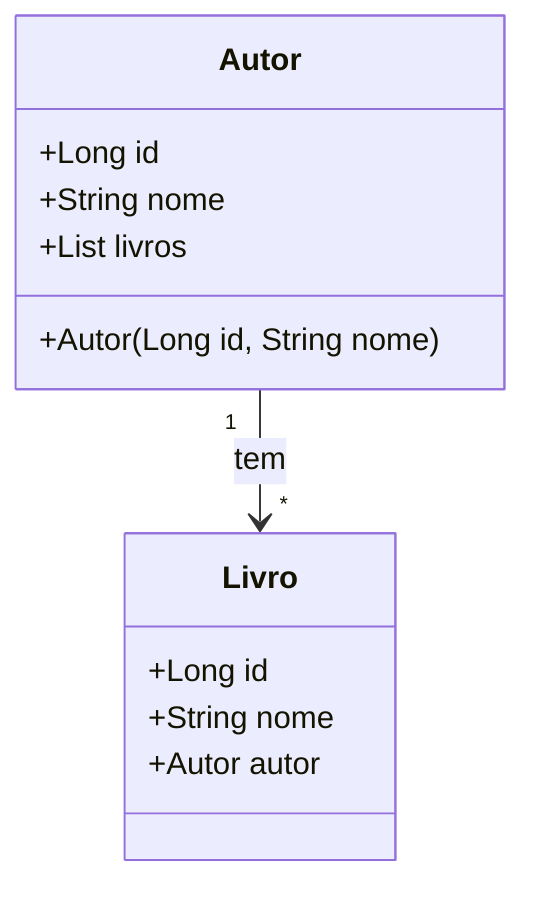

## Ferramentas e tecnologias utilizadas

- java 17;
- Spring Boot 3;
- Lombok
- Springdoc (Swagger)
- Postgres
- H2 Database
- IDE - Intellij

## Descrição básica
- Esta api visa criar um Back-end de uma aplicação de livraria com a relação de livros e autores.
- Possui as funcionalidades básicas de um sistema :
  - Criar;
  - Atualizar;
  - Pesquisar por id;
  - Pesquisar todos;
  - Apagar.
- Além de um usuario admin. 

## Descrição técnica
- API em spring Boot
- DTO
- Usuário admin com autenticação e autorização JDK

## Diagrama de classes

## Acesso a API

### acessar o console do h2 database 
- http://localhost:8080/h2-console

### acessar a url no swagger localmente
- http://localhost:8080/swagger-ui/index.html

### json online edit
- https://jsoneditoronline.org/

## Estrutura de pacotes do projeto

| Pacote     | Descrição                                    |
|------------|----------------------------------------------|
| controller | Classes que gerenciam as requisições da API  | 
| model      | Entidades do domínio da aplicação            |
| repository | Inteface de acesso a base de dados           |
| service    | Classes com regras de negócio                |
| config     | Classes de dados de testes para popular o BD |
| exception  | Classes trata os erros do sistema            |
| dto        | Classes exibe informações básicas do usuário |

